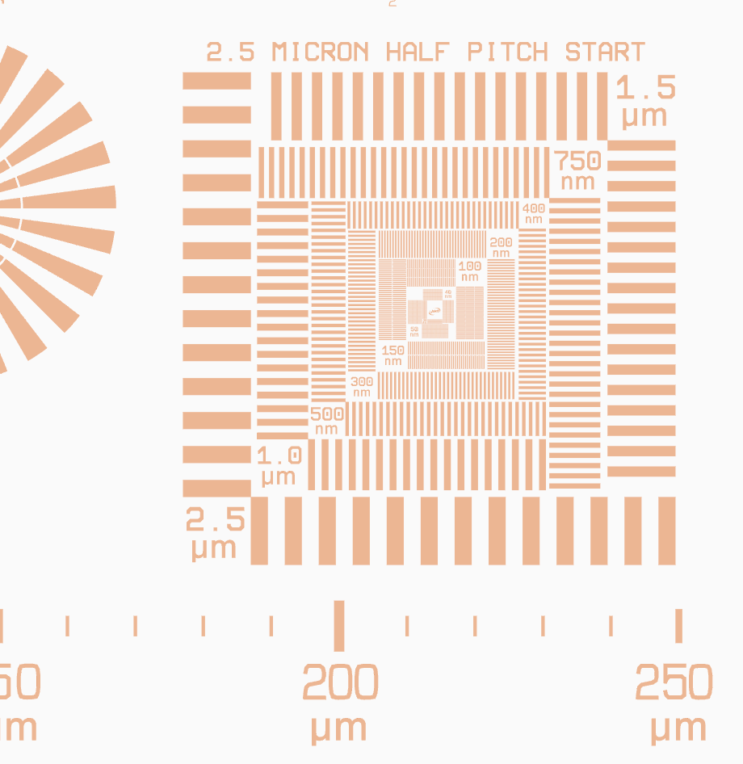
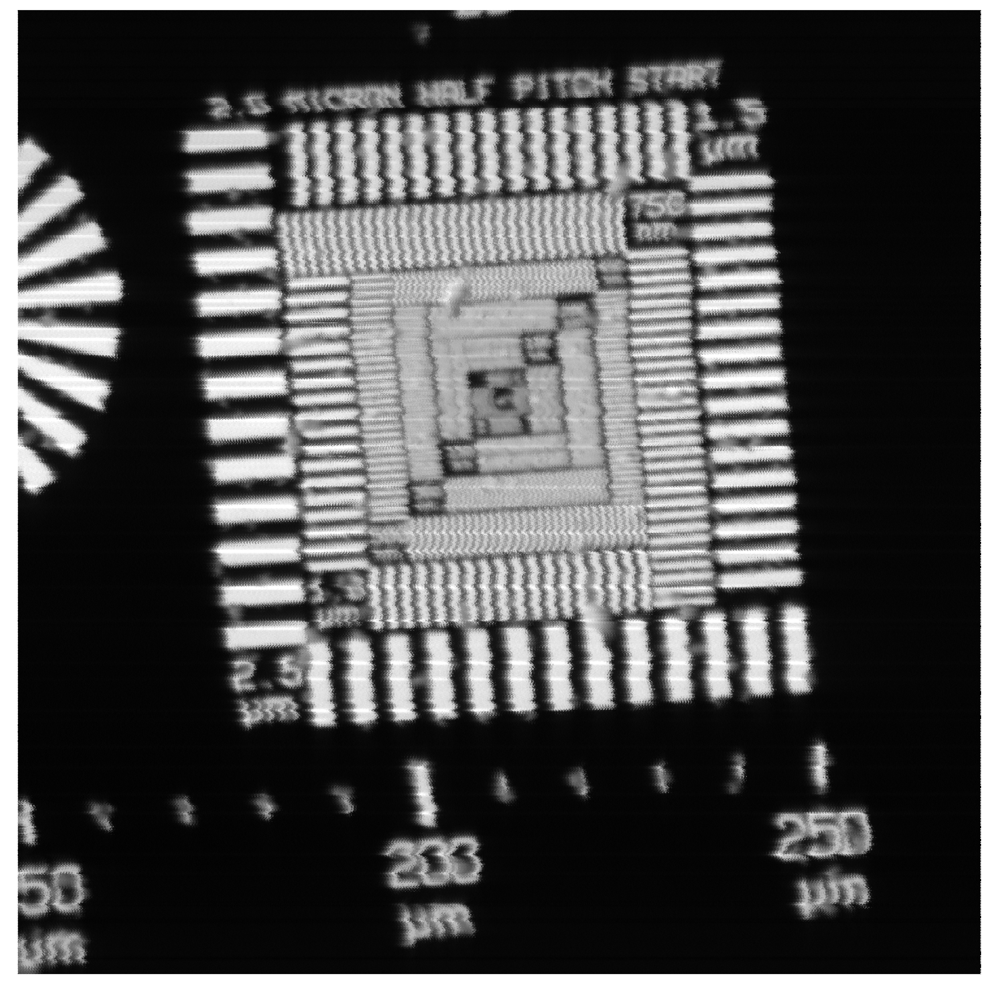

.. _Applied Nanotools:  https://www.appliednt.com/

..  _beamline-chapter:

=====================================================
General X-ray Microprobe Beamline Capabilities
=====================================================

The X-ray microprobe at GSECARS uses an undulator X-ray source to
provide fluxes in the range of :math:`10^{9}` to :math:`10^{13}` Hz in
a spot size ranging from 0.5 to 50 :math:`\rm{\mu}m` in both
directions and an energy range of 2.4 to 27 keV.  This micro-scale
beam can be used for X-ray Fluorescence maps, X-ray absorption
spectroscopy, and X-ray diffraction.  The description of the X-ray
microprobe beamline here is not meant to be an exhaustive explanation,
but to give guidance on using the beamline effectively.

Spot Size
==============

The typical X-ray spot size is :math:`1 \times 1` :math:`\rm{\mu}m`
using Kirkpatrick-Baez (KB) mirrors just before the sample that
separately focus in the horizontal and vertical directions. At this
writing (September, 2025) with the recent upgrade to the APS source
and improved X-ray optics, we have demonstrated beam sizes below 500
nm in both directions, though absolute positional stability from
beam-sample motion appears to be on a similar scale. Currently, a
resolution target from `Applied Nanotools`_ with a pattern like this:

is measured, using 100 nm pixels (5 msec dwelltime) in an XRF map:

We see (perhaps optimistically) lines in both directions for the 400
nm lines, but not the 300 nm lines.  There are periodic shifts of 400-
to 500 nm that we can correlate with monochromator cooling.  We also
see some random noise at the 200- to 300-nm scale that we suspect are
remaining vibrational and mechanical drifts.  Both of these are under
investigation, but even a conservative estimate puts the beamsize at
500 nm.

It is important to keep in mind that X-rays penetrate deeply into most
materials, with intensities dropping exponentially.  For most
geological materials :math:`1/e` sampling depths range from 5 to 250
:math:`\rm{\mu}m`, with 50 :math:`\rm{\mu}m` being a good rule of
thumb. It takes 3 absorption lengths to absorb or scatter 95% of the
X-rays.  For many samples, then, the volume illuminated with the
X-rays will be a "beam" about :math:`0.5 \times 0.5 x 100 \rm{\mu}m`.

Energy Range
==============

The energy range for the GSECARS microprobe is 2.4 to 27 keV.  The
monochromator has very reliable energy reading, and XAFS scans are
generally easy to do and robust. Changing energy between diferent
element edges is very easy for energies between 4 and 22 keV and can
be done from pre-defined "macro" scripts that will move the
monochromator angle and height, set the undulator harmonics, mirror
coatings, and do an automated search for the beam in order to be able
to keep the beam position stable during measurements.
That is, automated switching between different element edges can be
reliably done and automated in overnight macro sequences.

low energies
-------------

At low energies, say S and Cl K edges and other edges below 3.5 keV, we'll
almsot certainly want to put the sample in a He environment -- a very large
zip-lock bag.  For most higher energy work this bag is kind of nuisance, so
we normally do not have this in place.  Setting it up doesn't take very
long, but it means that we can't easily "just try" S K-edge XANES.

In addition, the monochromator angle and height of the second crystal
for Si(111) changes quite a bit between 2.4 and 4 keV. Moving from 2.4
to 4.0 keV is a larger angular change than moving from 4.0 to 20 keV.
Because of the large angle and 2nd crystal height, a relatively large
*roll* (left-right steering) of the beam can occur unless the
monochromator crystals are very close to parallel.  The automated
scripts to move energy can usually find the beam, but this is trickier
(and can fail) when going to low energy.  In short, Matt or Tony
should be around the first time you move to low energy, to make sure
the scripts to move back and forth from low to high energy are working
well.

We generally expect to setup up for S or Cl measurements ahead of
time.  It is cpossible to move between S and Cl edges and higher
energies (say, up to 12 keV) multiple times per day, but we do
recommend limiting the number of times you do this, and to not expect
switching to always be simple.

high energies
--------------

Working between 22 and 27 KeV is possible, but also needs some
planning. At 22 keV, the rhodium-coating on the mirrors starts to lose
reflectivity at their nominal pitch of 3 mrad.  The in-hutch KB
mirrors will need to be moved to lower pitch (say, 2 mrad), and the
incident flux will start to drop.  In addition, the sensitivity of the
Si fluorescence detectors diminishes above about 20 keV.  This all
means that our sensitivity is much lower for edges about 22 keV than
we normally expect from our experiene below 20 keV.

Positional Stability
======================

The monochromator deflects the beam vertically, and is meant to be
`fixed offset`, with a nominal offset of 25 mm above the plane of the
storage ring.  To do this, the gap between the first and second
monochromator is moved.  This motion can have small (micron-level)
instabilities, but overall the height of the beam is maintained to
better than about 10 microns.

The pitch and roll of the second monochromator crystal can be adjusted
with either motors for larger motions or piezo-electric crystals.

These motions move the beam vertically and horizontally.  The overall
stability is very good -- typically a few microns at the X-ray Beam
{osition Monitor (around 41 m from the source, just in front of the
Secondary Source Aperture).  We *can* measure this and use a feedback
loop to stabilize the vertical beam position by adjusting the pitch on
the second crystal.  We normally do this only at low energies (high
monochromator angles) we do use a "very slow feedback" process to keep
the vertical beam position stable.

The monochromator can also steer the beam horizontally (*roll*) if the
two crystals are not parallel.  The effect is typically small, but the
beamline uses two horizontally mirrors (normally, with both at 3 mrad)
just after the monochromator to deflect the beam horizontally to
increase the separation between the E-branch and the C-D branch of
13-ID.  That doublre-reflection ////amplifies any horizontal motion from
the monochromator.  Because we focus the beam in the horizontal to
about 350 microns, and slit this beam down to around 70 microms to
make a Seconday Source at 42 m from the source (and 16 m from the
monochromator), a small roll in the monochromator can have a big
effect on beam intensity and positional stability.  We normally *do*
use a feedback loop to adjust the beam position at the X-ray Beam
Position Monitor.

With the Position essentially fixed to a few microns at the Secondary
Source point, the position of the final focus beam is very good, even over
large energy moves.  Unless we bump something on the table, that is.

..  _beamline-stages:

Sample Stage
===================

In the Microprobe station, the sample normally sits at 45 degrees to the
incident beam, and is held in place by a large Sample Stage.  This stage
has 5 axes, and sometimes a 6th is added.  The three largest stages are
orthogonal and at 45 degrees to the beam, so that they give motion along
Cartesian coordinates relative to the microscope, and are called the
*Coarse Stages*, though the precision of these stages is actually 1 micron.
Here, *Coarse X* is horizontal and in the microscope focal plane, *Coarse
Y* is vertical and in the microscope focal plane, and *Coarse Z* moves the
Sample normal to the microscope focal plane (and so is often referreed to
as *Focus*).  The *Coarse X* and *Coarse Z* motions have 200 mm of travel,
and the *Coarse Y* (vertical) stage has 300 mm of travel.

In addition, there are two smaller stages hung from the large orthogonal
stack giving *Fine X* and *Fine Y*.  These stages are smaller and higher
precision (better than 0.1 micron) than the coarse stages, and closer to
the sample holder.  This means that moving just these fine stages can give
much more accurate and reproducible motions of the sample.  However, these
stages have much less travel range (25 mm for *Fine X* and 5 mm for *Fine
Y*), so both the coarse and fine stages are necessary to access all samples
on most sample mounts.

The sample mounts are typically plastic holders that can hold either
microscope slides or 1 inch round sections.  These holders mount to the
stages with a magnetic kinematic mount, that are strong enough to hold many
samples and reproducible to 10 to 25 microns (that is, you can take the
sample holder off and put it back on and the sample will return to within
25 microns of its earlier position).  For some measurements, notably
fluorescence tomography, a rotation stage *Theta* is added to the stack of
fine stages, and samples are attached to a goniometer head centered on this
rotation stage.

In all cases, the sample mounts hang down from the fine stages, which are
also mounted from above.  This gives plenty of working space below the
sample holder and also allows gravity to be a stabilizing force.

Sample Microscope
==============================

The sample microscope sits normal to the sample (so, 135 degrees to the
beam), and is used to locate the spot to analyze.  That is, we typically
put in a phosphorescent material to find the X-ray beam, then use the focal
plane of the optical microscope to know where the beam will hit the sample
That gives pretty good, but not perfect, precision.  Because it relies on
finding the focal plane, because the sample sits 45 degrees to the incident
beam, and and because of the penetrating nature of X-rays, the positional
precision is much less certain in the horizontaly than vertically.

The microscope gives a pretty good optical image of the sample of around
400 x 550 microns, using a 10x objective and a high resolution (1928x1440)
color CCD camera.  We sometimes use a 5x objective to give a larger field
of view.  The lighting can be either through-the-lens reflected light or a
lamp to give transmitted light.

X-ray Fluorescence Detector
==============================

The fluorescence detector used is a Vortex ME-4 silicon drift detector,
using Xspress3 electronics from Quantum, Inc.  Each of the 4 detector
elements can count up to about 3 MHz.  We normally try to run these at 1
MHz or less to avoid saturation -- this can be corrected but becomes noisy
above 3 MHz.  At low count rates (say, below 100 kHz), the spectral
resolution is very good: as low as 135 eV at 5.9 keV, which is as good as
one can do with a silicon detector.  The energy calibration is very good,
and stays stable with count rate and over time.

For XRF mapping, we slew the Sample Stage in the beam and trigger the
detector to collect 4 full spectra per pixel.  We're able to collect full
spectra in as short as 2 ms, though we typically use per-pixel dwell times
of 10 to 50 ms.

X-ray Diffraction Camera(s)
==============================

To do X-ray diffraction
