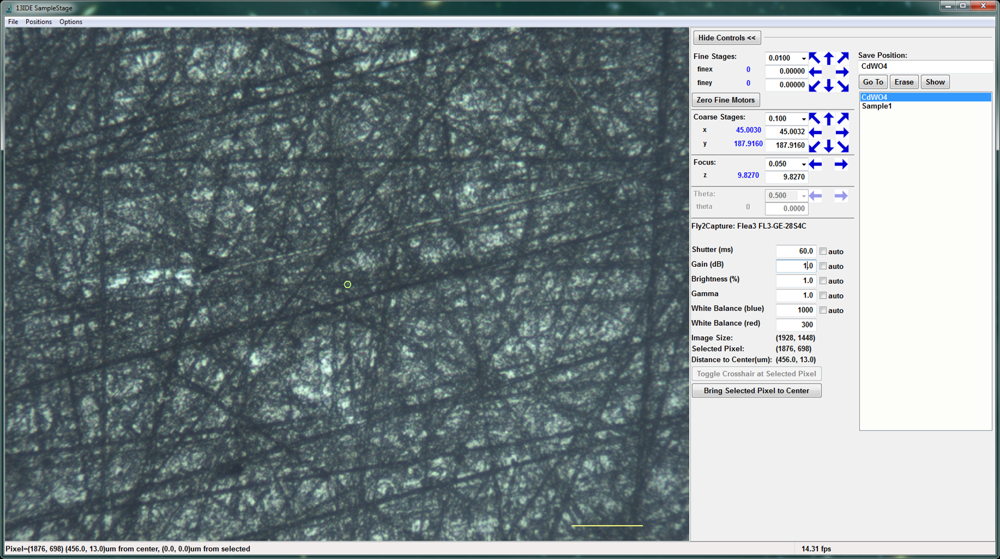
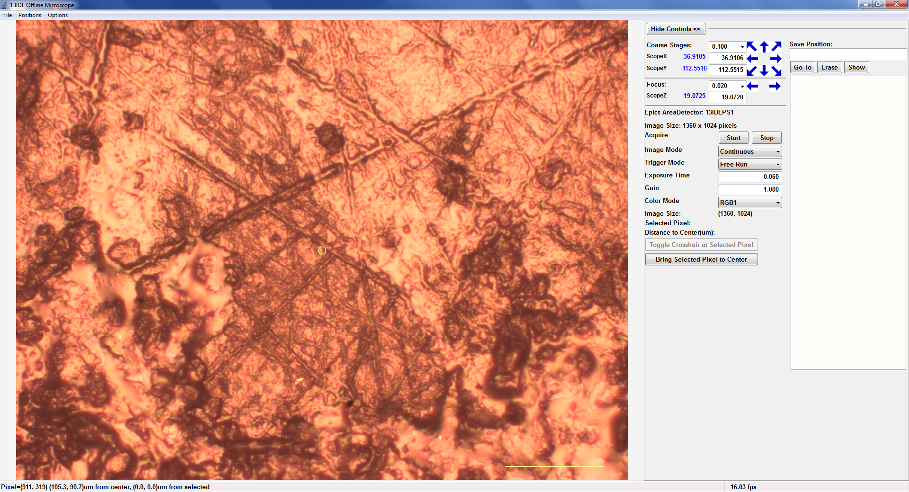

..  _oscar-chapter:

Using the SampleStage Control and Off-line Microscope
=======================================================

For most microprobe users, moving your sample into the beam, finding and
saving places to analyze, and capturing the video images are all important
parts of the data collection process. As mentioned in :ref:`Getting Started
at the Beamline <starting-chapter>`, the Sample Stage window is the main
interface for all of these controls.  The Sample Control Window will look
like this:

and shows a live image of your sample.  Typically, the field of view is 1
mm (a 100 micron scalebar in shown in the lower right of the image).  There
are 2 other video cameras at the beamline to see roughly 30 mm and 1 m
fields of view around the Sample-Beam position.

From the Sample Stage Window you can move the sample stage motors using
arrows, dropdown menus, or typing in absolute values for the position of
each of the sample stages used (there are five or six of these, depending
on your experiment). You can also adjust the video controls (shutter time,
gain, color balance, and so on).  Finally, you can als save positions by
giving them a name.  Simply typing a name and hitting return will save the
current position, and add it to the list of Saved Positions in the right
hand side.  You can select any of these, and then hit **Go To** to move
that Saved Position.  Saving a position also captures the image so that you
can view it later, including from a simple HTML file `SampleStage.html` in
the main data directory.

The Off-line Microscope
===================================

