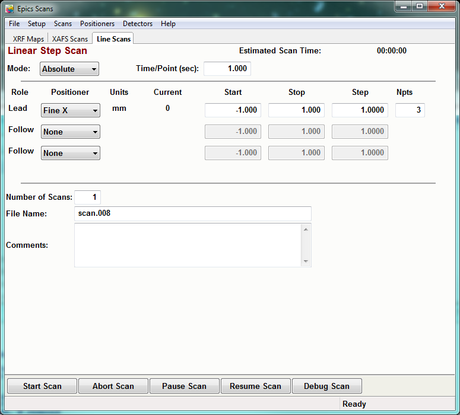
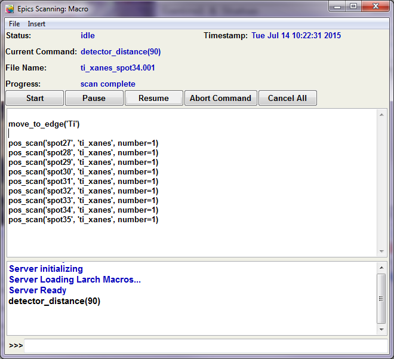
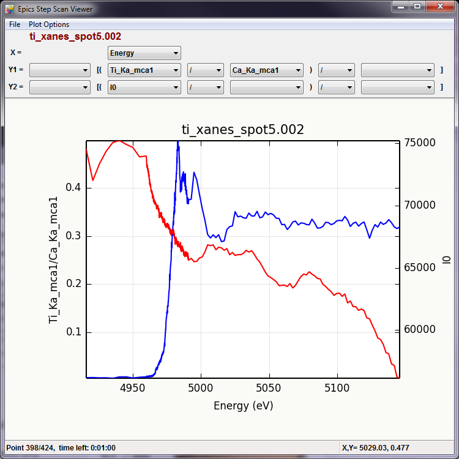
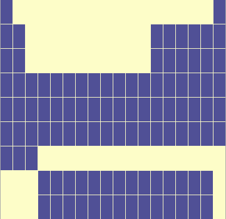
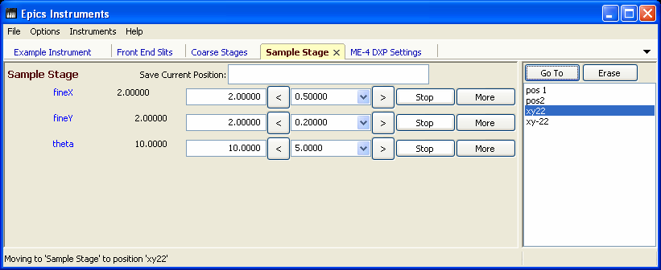
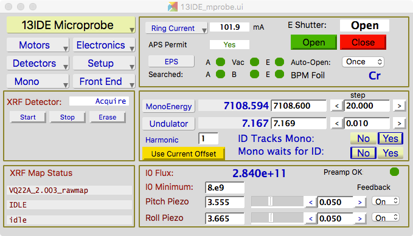

..  _starting-chapter:

Getting Started at the Beamline
======================================

When you come to the beamline, Tony and Matt should have the beamline
mostly set-up for your measurements.  Sometimes, we will need to either set
up or take down a special detector (say, for X-ray Diffraction) or sample
environment at the start of your beamtime.  We may also have to cahnge some
beamline properties, sucha as energy range or focus.  These tasks normally
do not take very long.  If you have samples that you want to view under a
microscope to select areas for analysis, this is a fine opportunity to use
the :ref:`Offline Microscope (OSCAR) <oscar-chapter>`.

.. index:: Working Folder

The software too should be ready, or nearly so.  You will have a user
folder on the GSECARS Data array, under the Windows folder ``T:/xas_user``.
Typically, your **Working Folder** will be something like
``T:/xas_user/2015.3/YourName``, where ``2015.3`` will be the current
year + run number (1, 2, or 3).  Several data collection programs will ask
you for a **Working Folder**, and you should choose this folder. There are
five applications needed to run the beamline:

 *  :ref:`Epics Scans <starting-epicsscan>`.

 *  :ref:`X-ray Fluorescence Detector <starting-xrfdetector>`.

 *  :ref:`Sample Stage <starting-samplestage>`.

 *  :ref:`Epics Instruments <starting-instruments>`.

 *  :ref:`Epics Display Manager <starting-caqtdm>`.

You probably won't really use these last two very much, but we mention them
here on the unusual chance that you have to start-up the computer.

These applications can each launched from the desktop with the icons, and
are discussed in more detail below.

..  _starting-epicsscan:

Epics Scans Application
--------------------------------------------

This is the main program you will use for setting up XRF maps, XAFS scans,
and running data collection scripts. It can be launched with the desktop icon

Which will then bring up 3 separate Windows, the main Epics Scan Window to
setup scans and run them one at a time:

a Command Window for running commands and writing data collections scripts:

and a Plotting Window:

..  _starting-xrfdetector:

X-ray Fluorescence Detector Application
---------------------------------------------

This application allows you view and interact with the live spectrum from
the X-ray Fluorescence detector.  It can be launched with the desktop icon

which will bring up a window that looks

.. image:: _images/XRFcontrol.png
    :width: 80%

This will allow you to identify peaks in an XRF spectrum, re-start the
spectrum acquisition.  Counts and Counts-per-second can be read in the
status bar at the bottom of the screen.

..  _starting-samplestage:

Sample Stage Application
---------------------------------------------

This application allows you to drive the sample around in the X-ray beam,
view the microscrope image and save positions for detailed analysis. It can
be launched with the desktop icon

This will bring up a window that looks like

.. image:: _images/SampleStage_control.png
    :width: 80%

From here you can drive the stages around with the controls for the Sample
Stage Motors on the upper left portion of the window, and adjust the camera
settings in the lower left portion of the window.  In the upper right, you
can type any name and hit **Save** to save the current position of all the
motors, and save the optical image.  This will build a list of Saved
Positions in the right hand side.  You can select any of these, and then
hit **Go To** to move that Saved Position.

The Sample Stage shows a live image of the On-line sample microscope, with
an approximately 500 micron field of view.  It also shows a circle
(approximately 10 microns across) at the center of the image, and a 100
micron scalebare in the lower right.  The color and size of these can be
adjusted from the Options menu.

You can click on any spot on the the image and then hit the **Bring to
Center** button in the lower left.  This will move the selected spot to the
center of the image.  Generally, this will be close to the location of the
X-ray beam.

The Saved Positions from the Sample Stage can be accessed from the Command
Window from the main Epics Scan Window.   If you use the :ref:`Offline
Microscope (OSCAR) <oscar-chapter>`, you will notice that it has a very
similar interface.  In addition, the list of Sample Positions from the
Offline Microscope can be transferred to the SampleStage.

..  _starting-instruments:

Epics Instruments Application
---------------------------------------------

This application gives an easy-to-use way to drive beamline instruments,
and to move these between pre-defined positions.  Like the SampleStage, it
allows you to save any position by name and then return to it later.
It can be launched with the desktop icon

which will bring up a window that looks like

Note that this application can be a bit slow to initialize, but then should
run without problem.

..  _starting-caqtdm:

Epics Display Manager (caQtDM) Application
---------------------------------------------

This application shows many *low level* screens for the Epics control
system. It can be launched with the desktop icon

From the Start Window many other displays can be opened, giving low-level
access to beamline components.  You will want to open choose **13IDE
Experiments** then **13IDE Microprobe** to bring up a screen that looks like

