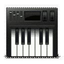

..  _starting-chapter:

Getting Started at the Beamline
======================================

When you come to the beamline, Tony and Matt should have the beamline
mostly set-up for your measurements.  Sometimes, we will need to either set
up or take down a special detector (say, for X-ray Diffraction) or sample
environment at the start of your beamtime.  We may also have to cahnge some
beamline properties, sucha as energy range or focus.  These tasks normally
do not take very long.  If you have samples that you want to view under a
microscope to select areas for analysis, this is a fine opportunity to use
the :ref:`Offline Microscope (OSCAR) <oscar-chapter>`.

.. index:: Working Folder

The software too should be ready, or nearly so.  You will have a user
folder on the GSECARS Data array, under the Windows folder ``T:/xas_user``.
Typically, your **Working Folder** will be something like
``T:/xas_user/2015.3/YourName``, where ``2015.3`` will be the current
year + run number (1, 2, or 3).  Several data collection programs will ask
you for a **Working Folder**, and you should choose this folder. There are
five applications needed to run the beamline:

 *  :ref:`Epics Scans <starting-epicsscan>`.

 *  :ref:`X-ray Fluorescence Detector <starting-xrfdetector>`.

 *  :ref:`Sample Stage <starting-samplestage>`.

 *  :ref:`Epics Instruments <starting-instruments>`.

 *  :ref:`Epics Display Manager <starting-caqtdm>`.

You probably won't really use these last two very much, but we mention them
here on the unusual chance that you have to start-up the computer.

These applications can each launched from the desktop with the icons, and
are discussed in more detail below.

..  _starting-epicsscan:

Epics Scans Application
--------------------------------------------

This is the main program you will use for setting up XRF maps, XAFS scans,
and running data collection scripts. It can be launched with the desktop icon

Which will then bring up 3 separate Windows, the main Epics Scan Window to
setup scans and run them one at a time:

.. image:: _images/EpicsScan_LineScan.png
    :width: 50%

a Command Window for running commands and writing data collections scripts:

.. image:: _images/EpicsScan_Commands.png
    :width: 50%

and a Plotting Window:

.. image:: _images/EpicsScan_Plotter.png
    :width: 50%

..  _starting-xrfdetector:

X-ray Fluorescence Detector Application
---------------------------------------------

This application allows you view and interact with the live spectrum from
the X-ray Fluorescence detector.  It can be launched with the desktop icon

.. image:: _images/ptable_icon.png
   :width: 30px

which will bring up a window that looks

.. image:: _images/XRFcontrol.png
    :width: 80%

This will allow you to identify peaks in an XRF spectrum, re-start the
spectrum acquisition, and read conts in each pre-defined ROI.

..  _starting-samplestage:

Sample Stage Application
---------------------------------------------

This application allows you to drive the sample around in the X-ray beam,
view the microscrope image and save positions for detailed analysis. It can
be launched with the desktop icon

.. image:: _images/microscope_icon.png
    :width: 30px

This will bring up a window that looks like

.. image:: _images/SampleStage_control.png
    :width: 80%

This has nearly the same interface as the :ref:`Offline Microscope (OSCAR)
<oscar-chapter>`, though the Sample Stage has more stages, a slightly
better camera but it is more difficult to change the magnification.

..  _starting-instruments:

Epics Instruments Application
---------------------------------------------

This application gives an easy-to-use way to drive beamline instruments,
and to move these between pre-defined positions.  It can
be launched with the desktop icon

which will bring up a window that looks like

..  _starting-caqtdm:

Epics Display Manager (caQtDM) Application
---------------------------------------------

This application shows many *low level* screens for the Epics control
system.
