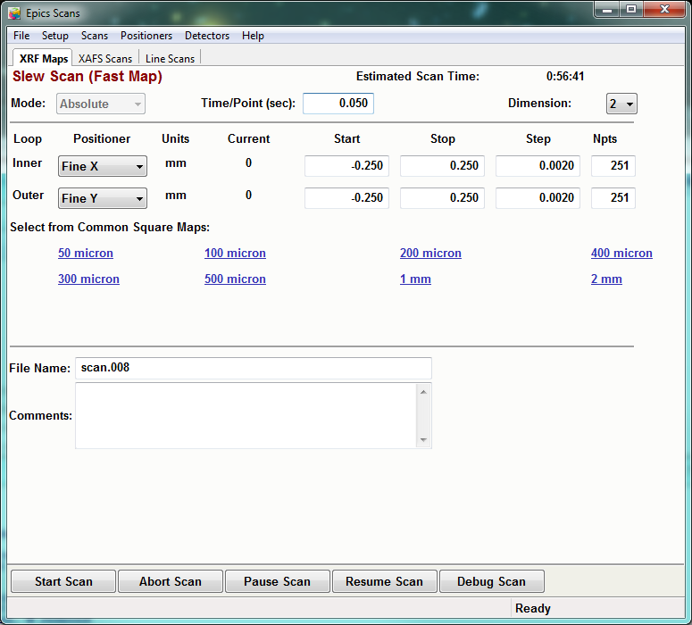

..  _xrfmaps-chapter:

Collecting X-ray Fluorescence Maps
======================================

XRF maps are a core part of the data from the X-ray microprobe.  These maps
collect a full XRF spectrum (actually 4 spectra, 1 for each of the 4-element
detector) at each pixel in a map.  The dwell time per pixel is typically 10
to 100 ms.

To collect an XRF map, you use the :ref:`Epics Scans <starting-epicsscan>`
program.  From the main program, select the **Slew Scan** tab, showing a
screen like this:

With this form, you can select the stagese to scan, the distances, step
sizes and dwell time for each pixel.  The *inner* scan dimension is moved
continuously during the scan, and must be one of *Fine X*, *Fine Y*, or
*Theta*.  Each complete transect of this inner stage gives a row for the
map.  The *outer* scan dimension is stepped at each row, and can be
essentially any stage.  For most XRF maps, *Fine X* is used as the inner
stage and *Fine Y* as the outer stage.  For fluorescence tomographay,
*Theta* is typically used as the inner stage and *Fine X* as the outer
stage.

For all XRF maps, you choose the *Start*, *Stop* positions for the stage,
and the *Step Size* for both inner and outer dimensions.  For the inner
axis the motion is continuous, and the step size really indicates where the
transitions for the pixels will be.  The step sizes do not have to be the
same, but this is the most common approach.  Note that the *Start* and
*Stop* positions are in the absolute coordinates of the stages (see
:ref:`beamline-stages`).  It is most common to have the maps be centered at
some particular Coarse stage position, with *Fine X* and *Fine Y* both at
0.0.  The map definitions can then be centered on (0, 0).  This allows the
map definition to be easily re-used at another location.
